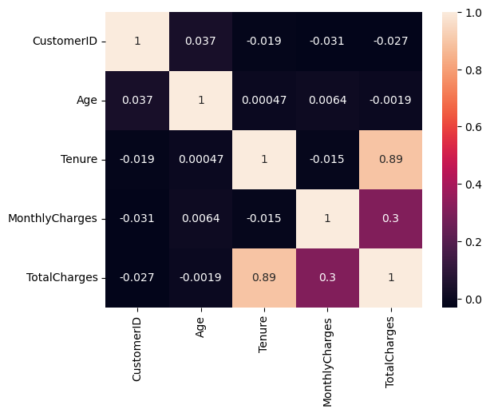
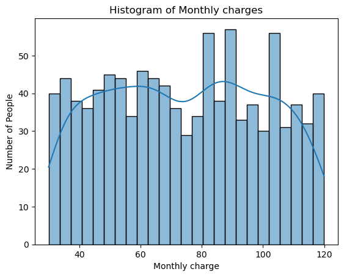
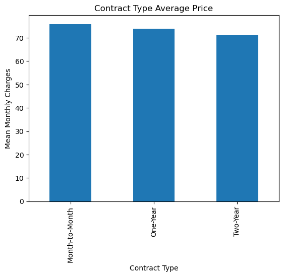
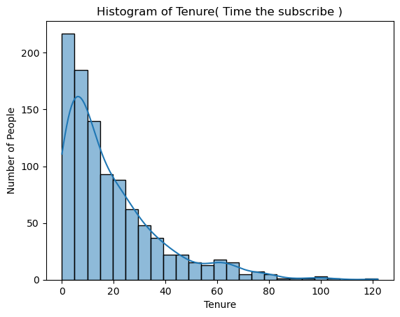
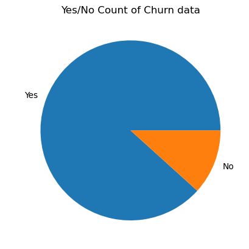

# Customer Churn Prediction – Machine Learning Project

## 📌 Project Overview
This project predicts whether a customer is likely to **churn (leave the service)** based on demographic, contract, and service-related features.

The objective was to build a **reliable, interpretable, and deployable machine learning model**, while avoiding common pitfalls such as data leakage and overfitting.

The final solution follows an **end-to-end ML workflow**:
EDA → Feature Engineering → Model Selection → Evaluation → Deployment.

---

## 📊 Dataset
- **Type:** Customer churn dataset (CSV)
- **Target Variable:** `Churn` (`Yes` / `No`)
- **Problem Type:** Binary Classification

### Key Features Used
- Age  
- Tenure (months)  
- MonthlyCharges  
- Gender  
- ContractType  
- InternetService  
- TechSupport  

> ⚠️ **Important:**  
> Cumulative billing features such as `TotalCharges` were intentionally removed to avoid **target leakage**, which can artificially inflate model performance.

---

## 🔍 Exploratory Data Analysis (EDA)

EDA was performed separately to understand data distribution, class imbalance, and feature–target relationships.

Notebook:
- `Customer_churn_analysis_EDA.ipynb`

### Key Insights
- Churn is strongly associated with:
  - Short tenure
  - Month-to-month contracts
  - Lack of tech support
- The dataset is **imbalanced**, with non-churn customers being the majority
- Certain service-related features are strong churn indicators

## 📈 Exploratory Data Analysis (EDA)

EDA was performed to understand feature distributions, relationships with churn, and overall dataset characteristics that could influence model behavior.

---

### 🔗 Correlation Analysis

**What this shows:**  
This heatmap visualizes the correlation between numerical features in the dataset.

**Insight:**  
Tenure and MonthlyCharges show meaningful relationships with churn-related behavior.  
Highly correlated cumulative features were examined carefully to avoid **data leakage**, and only relevant, non-leaking features were retained for modeling.

---

### 💰 Monthly Charges Distribution

**What this shows:**  
This histogram displays the distribution of monthly charges across customers.

**Insight:**  
Monthly charges are right-skewed, with most customers clustered in the mid-range and fewer customers paying very high amounts.  
Higher monthly charges were observed more frequently among churned customers, making this an important predictive feature.

---

### 📄 Contract Type Distribution

**What this shows:**  
This chart shows the count of customers across different contract types.

**Insight:**  
A large portion of customers are on **month-to-month contracts**, which are typically associated with higher churn rates.  
Long-term contracts (one-year, two-year) indicate stronger customer commitment and lower churn risk.

---

### ⏳ Tenure Distribution (Left-Skewed)

**What this shows:**  
This histogram represents the distribution of customer tenure in months.

**Insight:**  
The distribution is **left-skewed**, indicating many customers have relatively short tenure.  
Short-tenure customers are more likely to churn, confirming tenure as a key factor in churn prediction.

---

### ⚖️ Churn Class Distribution

**What this shows:**  
This pie chart illustrates the proportion of churned (`Yes`) vs non-churned (`No`) customers.

**Insight:**  
The dataset is **imbalanced**, with non-churn customers forming the majority class.  
This motivated the use of **class-weighted models** instead of naive accuracy-based optimization.

---

### 📌 EDA Summary
Key findings from EDA:
- Churn is strongly associated with **short tenure**, **month-to-month contracts**, and **higher monthly charges**
- The dataset exhibits **class imbalance**
- Certain cumulative or correlated features must be handled carefully to prevent leakage

These insights directly guided feature selection, model choice, and evaluation strategy in the modeling phase.

